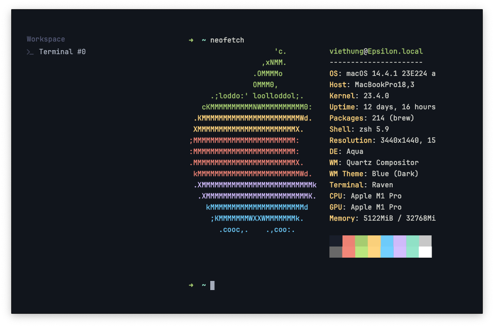

# Raven
> A toy terminal emulator powered by wezterm & freya

  

This is an experimentation project to test out the rendering performance of freya. The core of this terminal is extracted directly from [wezterm][1] & rendered to native window using [freya][2].

## Getting Started

1. Clone the repository
2. Run `cargo run`
3. That's it!

## Features

- [x] Resize
- [x] Drag to move
- [x] Scrolling
- [x] Colour
- [x] Font Ligature
- [x] Emoji Rendering
- [x] Selection
- [ ] Zoom In & Out
- [ ] Config file
- [ ] Multi-tabs
- [ ] Link clicking
- [ ] ChatGPT!
- [ ] Image viewing
- [ ] HiDpi Scaling

[1]: https://github.com/wez/wezterm/tree/main
[2]: https://github.com/marc2332/freya
